# 超级博客 · blog-server（后端）

> 一款基于 Spring Boot 2.7 + MyBatis-Plus + MySQL + Spring Security(JWT) 的博客系统后端服务。
>
> [English README →](./README_en.md)

## 🔗 项目地址

| 端 | 仓库地址 |
|----|----------|
| **后端 blog-server（本项目）** | https://github.com/vfaner/blog-server |
| **配套前端 blog-client** | https://github.com/vfaner/blog-client |

如果本项目对你有帮助，欢迎点一个 ⭐️ **Star**，这是对我持续维护开源项目最大的支持！

---

## ✨ 效果预览

### 博客首页
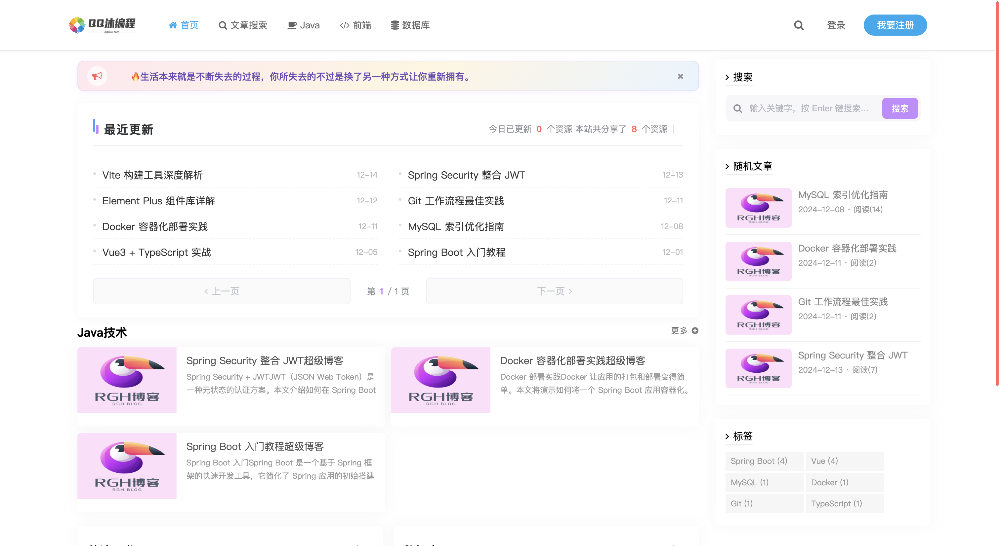

### 首页弹窗登录
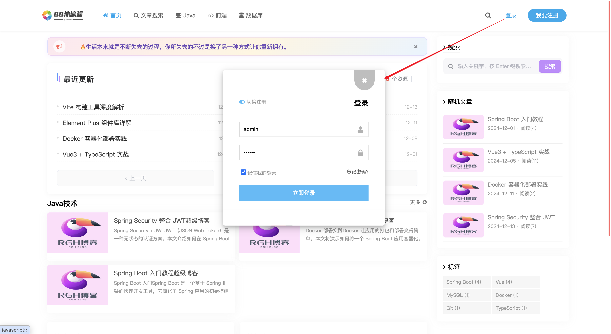

### 独立登录页（访问 `/admin/*` 未登录时跳转）
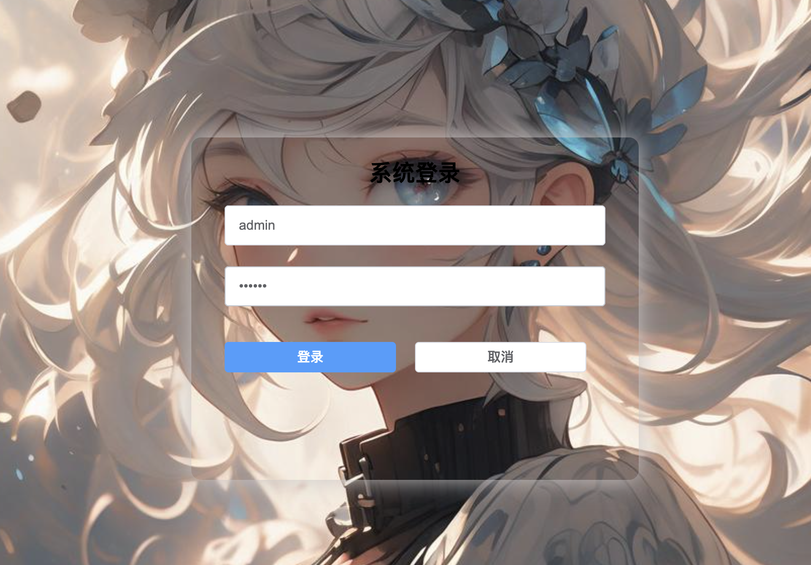

### 分类文章列表
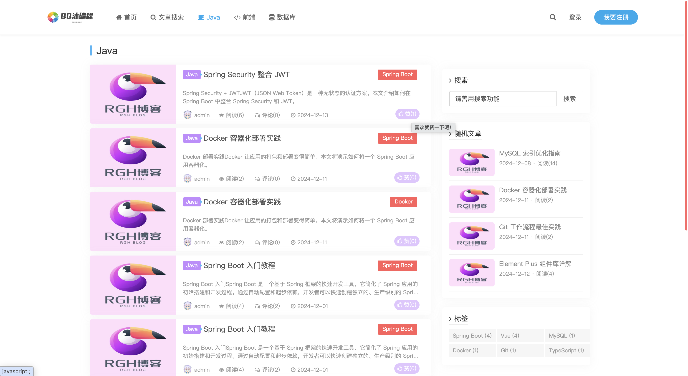

### 文章详情
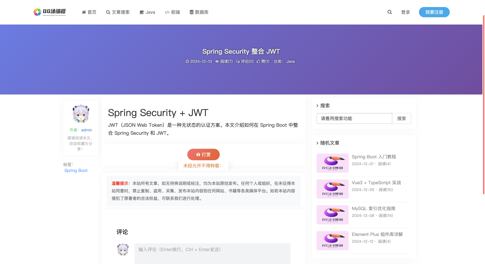

### 前台用户中心
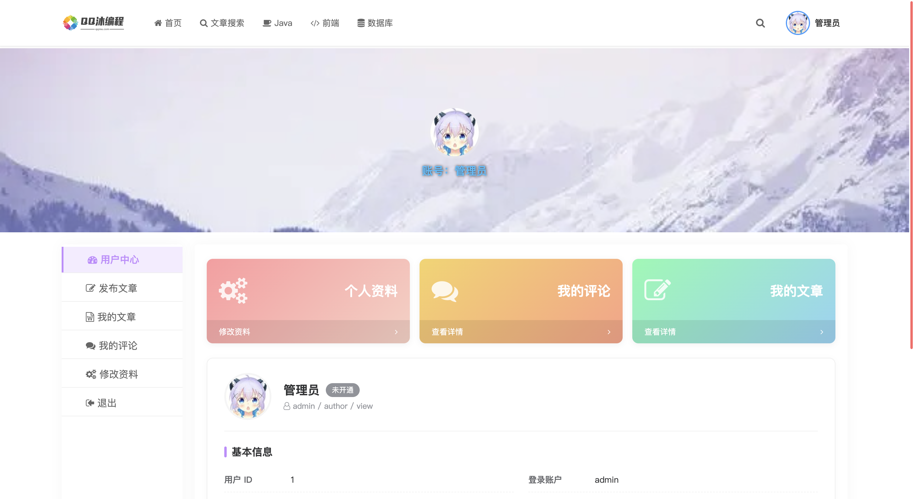

### 后台仪表盘
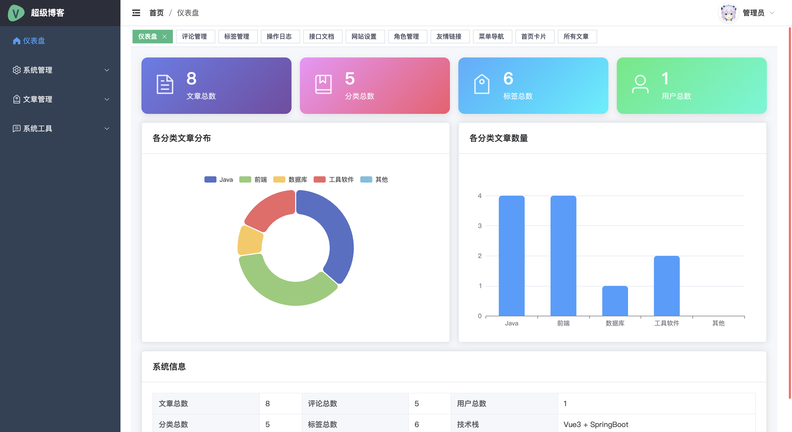

### 后台文章管理
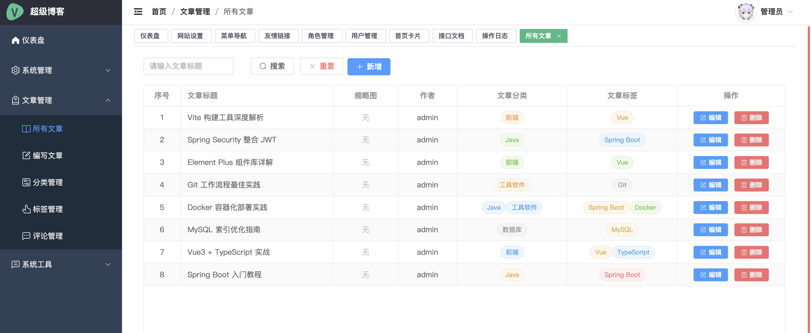

### 后台文章编辑
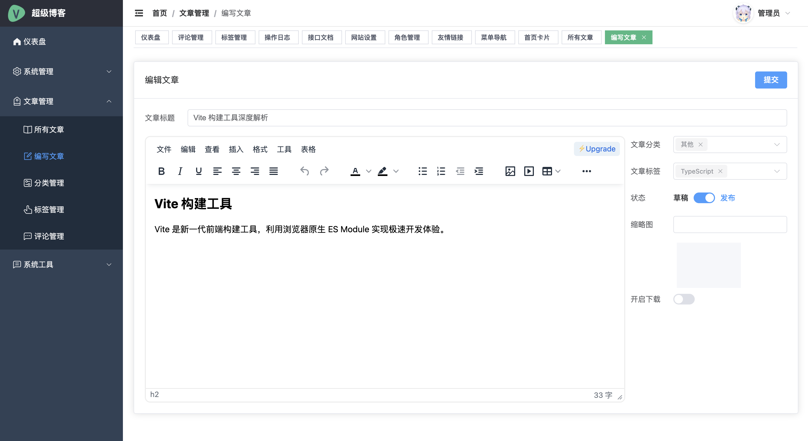

### 后台角色管理
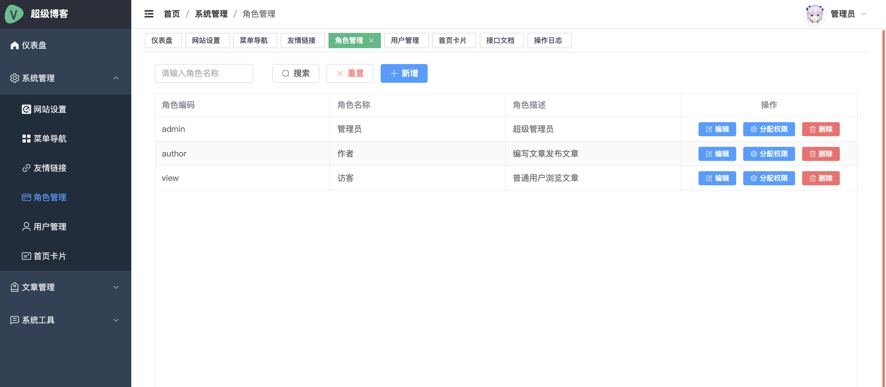

### 后台评论管理
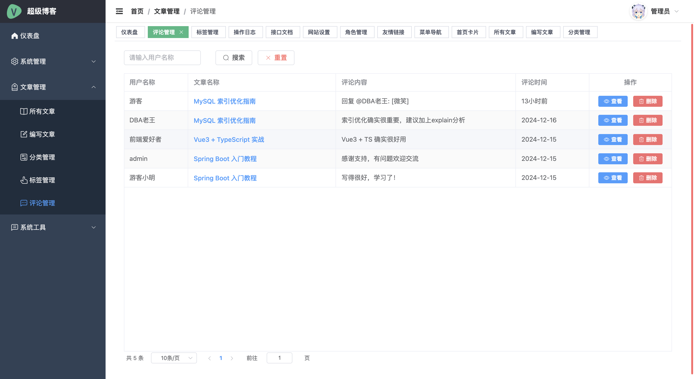

---

## 🚀 技术栈

- **JDK 17**
- **Spring Boot 2.7.18**
- **Spring Security + JWT (jjwt 0.12.6)**
- **MyBatis-Plus 3.5.5**（单表 CRUD）
- **MyBatis XML Mapper**（多表关联查询，方便 SQL 优化）
- **MySQL 8.x**
- **SpringDoc OpenAPI 1.8.0**（Swagger UI）
- **Lombok**
- **BCryptPasswordEncoder**

## 📦 功能特性

- 用户登录、JWT 鉴权、角色/菜单权限
- 文章、分类、标签、评论、友链、系统日志的完整管理
- 首页动态卡片（可自由配置分类/标签及展示条数）
- 文章阅读量、点赞数统计（数据库字段）
- 评论树形嵌套、回复继承文章归属
- 支持附件下载配置
- Dashboard 实时统计
- 首次启动自动补齐数据库缺失字段并初始化管理员密码

## 🏃 快速开始

### 环境要求
- JDK 17+
- MySQL 8.x
- Maven 3.6+

### 1. 创建数据库

```sql
CREATE DATABASE blog DEFAULT CHARACTER SET utf8mb4;
```

表结构与初始数据在启动时会由 `db/schema.sql` + `db/data.sql` 自动执行。

### 2. 修改配置

编辑 `src/main/resources/application.yml`：

```yaml
spring:
  datasource:
    url: jdbc:mysql://localhost:3306/blog?useUnicode=true&characterEncoding=utf8&serverTimezone=Asia/Shanghai
    username: root
    password: 你的密码
```

### 3. 启动项目

```bash
mvn spring-boot:run
```

启动后：
- 后端接口：http://localhost:8090/rgh/api
- Swagger 文档：http://localhost:8090/swagger-ui/index.html

### 4. 默认账号

| 用户名 | 密码 |
|--------|------|
| admin  | 123456 |

> 首次启动 `DataInitializer` 会自动将 admin 密码使用 BCrypt 重新加密。

## 🗂 项目结构

```
blog-server/
├── src/main/java/com/rgh
│   ├── conf/           # 安全、CORS、Swagger 等配置
│   ├── controller/     # REST 接口
│   ├── entity/         # 实体
│   ├── mapper/         # MyBatis Mapper
│   ├── service/        # 业务层
│   ├── vo/             # 视图对象
│   └── util/           # 工具
├── src/main/resources
│   ├── mapper/         # XML Mapper（多表关联查询）
│   ├── db/schema.sql   # 建表
│   ├── db/data.sql     # 初始数据
│   └── application.yml
└── pom.xml
```

## 🧩 与前端联调

前端项目：https://github.com/vfaner/blog-client

前端默认端口为 `8080`（若被占用会自动切换到 8081/8082…）。`SecurityConfig` 已放行 `http://localhost:*` 与 `http://127.0.0.1:*` 的跨域请求，所以任意本地端口都能直接联调。

---

## ❤️ 打赏 & Star

如果这个项目对你有帮助，可以请我喝杯咖啡 ☕️：


> 觉得不错的话，也别忘了在右上角点一个 ⭐️ **Star** 支持一下～

## 📄 License

MIT
